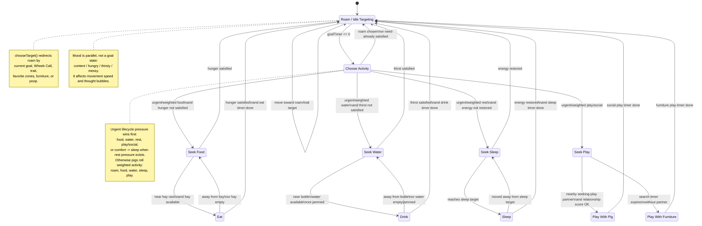

# Pig Lifecycle Diagram

This diagram shows how guinea pigs flow between simulation goal states. Mood and popcorn jumps are parallel presentation layers, not saved lifecycle goals.

## Code Anchors

- `src/simulation/types.ts`: `PigGoal` names.
- `src/simulation/systems.ts`: goal transitions, activity weighting, timers, and need restoration.
- `src/simulation/state.ts`: target selection for each goal.
